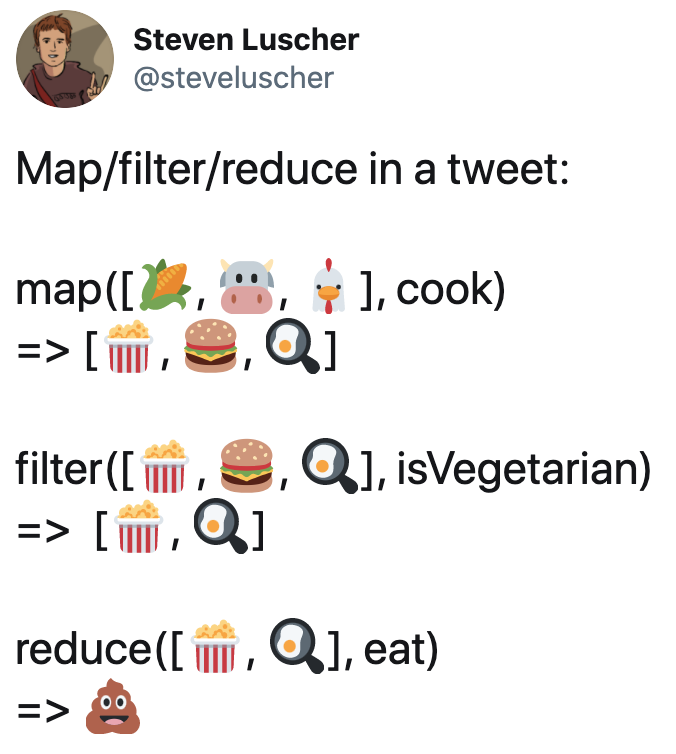

# Filter, map, reduce

You can use `filter`, `map` and `reduce` methods to manipulate Array items in a functional way.




## Filter

When you want to filter (i.e. return only some) items from the array.

Filter function returns a **new** array that contains only items that comply to a specified condition. Condition is represented by a function that is processed for each array item. If the function returns `true`, the item stays in the resulting array.

E.g. we want to filter food products that are vegetarian. Old way:

```
const products = [
	{
		title: "Tomato",
		vegetarian: true,
		calories: 18,
	},
	{
		title: "Beef",
		vegetarian: false,
		calories: 177,
	},
	{
		title: "Coca-Cola",
		vegetarian: true,
		calories: 140,
	},
];

const veg = [];

// we can do all the filtering by ourselves
for (let i = 0; i < products.length; i++) {
	if (products[i].vegetarian) {
		veg.push(products[i]);
	}
}

console.log(veg);

/* prints:

[
  { title: 'Tomato', vegetarian: true, calories: 18 },
  { title: 'Coca-Cola', vegetarian: true, calories: 140 }
]

*/
```

New way using `filter` function:

```
// This function contains condition for the filtering
function isVegetarian(prod) {
	return prod.vegetarian === true;
}

const filtered = products.filter(isVegetarian); // yes, it is here

console.log(filtered); // the result is the same as in the previous example
```

Using inline arrow function:

```
const filtered2 = products.filter((prod) => prod.vegetarian === true);

console.log(filtered2); // the result is the same as in the previous example
```

The old way is **descriptive**, i.e. you need to describe **HOW** you should do it, while the new way is *declarative*, i.e. you describe *WHAT* you want to do it.

The new way is more clear once you get used to it.


## Map

Map function transforms all items in the array and returns a **new** array, i.e. maps them to something else.

This means that function that changes **one** item must be provided.

Example: Get titles of food products together with their calories:

```
const products = [
	{
		title: "Tomato",
		vegetarian: true,
		calories: 18,
	},
	{
		title: "Beef",
		vegetarian: false,
		calories: 177,
	},
	{
		title: "Coca-Cola",
		vegetarian: true,
		calories: 140,
	},
];

// Transforms product to short text representation
function getTitleCalories(prod) {
	return `${prod.title}: ${prod.calories}`;
}

const onlyTitles = products.map(getTitleCalories);

console.log(onlyTitles);  // prints: [ 'Tomato: 18', 'Beef: 177', 'Coca-Cola: 140' ]
```

The same functionality using inline arrow function:

```
const onlyTitles = products.map((f) => `${f.title}: ${f.calories}`);
```


## Advanced: Other arguments

When we specified function that worked over one item of array, we utilized only 1 argument = the item itself. There are other arguments we can use. They are available in `filter`, `map` and `reduce`.

### Index

The second argument is the **index** of the item in the array. (For `reduce`, **index** is the third argument after **accumulator** and **current** arguments.)

We can e.g. print title of the product together with its order, e.g.:

```
1. Tomato
2. Beef
3. Coca-Cola
```

It can be easily done this way:
```
const lines = products.map((prod, i) => `${i}. ${prod.title}`);
```

The result is again array and we can e.g. print it.

### The whole array

The third argument is the **whole array**. It is useful when we need to e.g. compare
the current item against the whole array, compute average or median values etc.

Suppose we want to print not only order of the product but also total count of all products:

```
1/3 Tomato
2/3 Beef
3/3 Coca-Cola
```

It can be done this way:
```
const lines = products.map((prod, i, arr) => `${i}/${arr.length} ${prod.title}`);
```

In this case, it would be easier and smarter to compute the array length beforehand. But we wanted to use some pretty easy and simple example.


## Reduce

The previous functions `filter` and `map` transformed array to another array. `Reduce` functionality transforms an array into a single variable.

There is a so-called `accumulator` variable. This variable is initialized with a default value and then updated for each item in the array. In other words, you can specify a function that takes an array item and somehow updates the accumulator variable.

Lets see an example. We have a list of employees together with their monthly salaries and we would like to compute the overall sum of all money paid each month:

```
const employees = [
	{ name: "James Bond", salary: 10000 },
	{ name: "Forrest Gump", salary: 13000 },
	{ name: "Winnie the Pooh", salary: 4000 },
];

function addSalary(acc, curr) {
	return acc + curr.salary;
}

const total = employees.reduce(addSalary, 0);

console.log("Total amount", total);
```

The function `addSalary` is executed for each array item. It receives 2 parameters: **acc** = accumulator and **curr** = current array item.

- accumulator is used to add (pile) monthly salaries from each array item. In our case we assign to **acc** the previous value of **acc** plus salary from the **current** array item.
- current item can be used for our computation, i.e. we use it to get the salary of the current employee.

As previously, lets rewrite the example using inline arrow function:

```
const total = employees.reduce((acc, curr) => acc + curr.salary, 0);
```


## Advanced: Use reducer to find a max value

We can use reducer to iterate over the array and find e.g. the maximum salary.

```
const maxSalary = employees.reduce(
	(acc, curr) => (curr.salary > acc ? curr.salary : acc),
	0
);

console.log("Max salary", maxSalary);
```

As you can see, we use **acc** to hold the maximum salary. If the current salary is bigger, we update this value. If not, we keep the same value.


## Advanced: Chaining

It is easy to "chain" `filter`, `map` and `reduce`. Then, you can appreciate this declarative style of programming, because you can easily see the purpose of single steps.

Lets improve our example with employees and add a flag `human`. Lets write a code that returns the biggest salary of a human being.

```
const humanMax = employees
	.filter((e) => e.human)
	.reduce((acc, curr) => (curr.salary > acc.salary ? curr : acc), {
		name: "",
		salary: 0,
	});

console.log(`${humanMax.name}: ${humanMax.salary}`);
```

Firstly, we filter out all non-humans. Secondly, we find the maximum salary.
Notice that we want not only salary, but also a name of the employee. That's why we store in **acc** an object with `name` and `salary`.

This example chains filter and reduce. Of course, it is possible to chain more commands, e.g. several filters and maps.

On the other hand, it is possible to incorporate a filtering capability into the reducer. But, then we lose the simplicity and clear distinction of each step.
